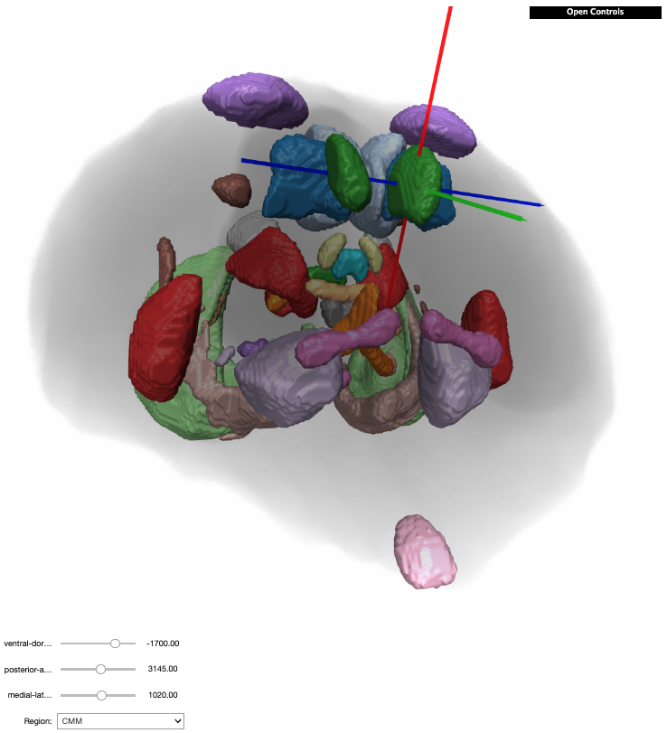

birdbrain
==============================

Tim Sainburg & Marvin Thielk

Work in progress.

This is a small library for viewing the songbird brain atlas' at https://www.uantwerpen.be/en/research-groups/bio-imaging-lab/research/mri-atlases/starling-brain-atlas/

### Usage Instructions
You can either view the data directly from the [binder notebooks](https://mybinder.org/v2/gh/timsainb/birdbrain/master?filepath=Index.ipynb) via your internet browser (reccomeded at first), or you can install and run this package locally on your own computer. 

### Installation
To install the python package:

`pip install birdbrain`

##### Additional requirements
To be added...

- **TODO**
  - the 2d visualizations should have the same widget tools as the 3d visualizations
  - making an atlas object should automatically download data when you call it, rather than having a seperate notebook for downloading
  - y sinus should be default the one we set manually, and a flag to leave it the other way
  - fix colormap error where adjacent nuclei will be labelled with the same color (e.g. NCM and field L)
  - update package to work with other atlas'
  - generate STL files from brain images
  - pip installable
  - binder notebooks
  - proposed updated y-sinus differs from actual updated y-sinus - this appears to have to do with laterality flipping...
  - update test_* for testing different features
  - remove jupyterlab_git from dependences (why is it there in the first place?)

#### References
- [Brain atlas](https://www.uantwerpen.be/en/research-groups/bio-imaging-lab/research/mri-atlases/starling-brain-atlas/) for starling, canary, zebra finch, pigeon, tilapia, and mustached bat brain atlas'
- [VTK python](https://pypi.org/project/vtk/) for 3d graphics 
- [K3D tools](https://github.com/K3D-tools/K3D-jupyter) for 3d visualization
- [nibabel](http://nipy.org/nibabel/) For reading/manipulating neuroimaging data (.img files)
- [cookiecutter data science](https://drivendata.github.io/cookiecutter-data-science/) project template was used

